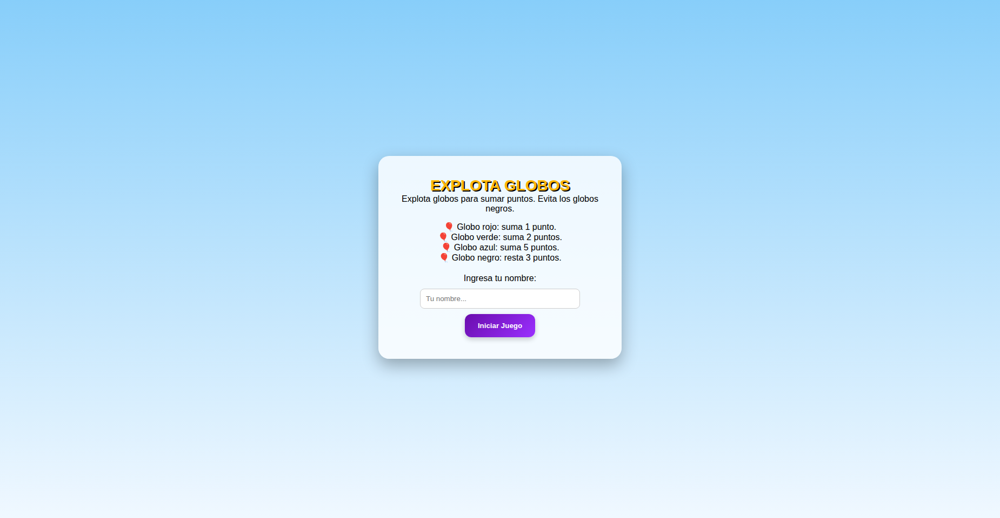
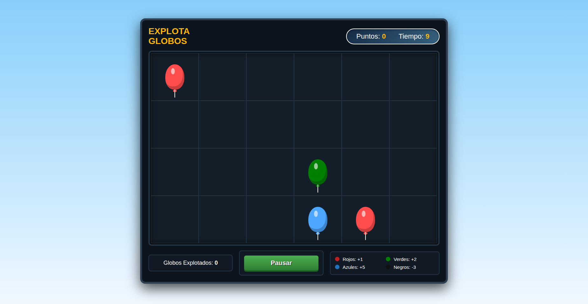
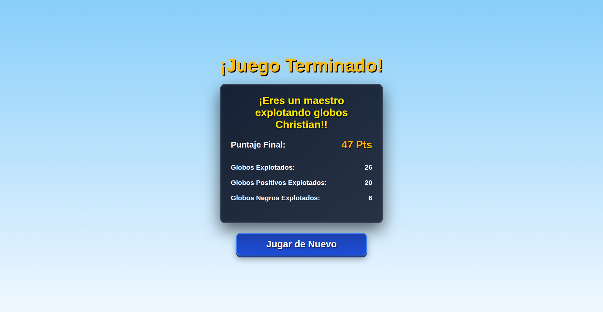

# 🎮 Juego de Globos React

## 👨‍🎓 Nombre del creador
Christian Rojas

## 📖 Descripción del juego
Este proyecto es un **juego interactivo de globos** desarrollado con **React + Vite**.  
El tablero está compuesto por 24 casillas donde aparecen globos de diferentes colores. Cada globo otorga o resta puntos según su color:  
- 🔴 Rojo: +1  
- 🟢 Verde: +2  
- 🔵 Azul: +5  
- ⚫ Negro: -3  

El jugador explota globos y acumula puntaje. El tablero se reinicia automáticamente cuando se alcanzan 5 globos activos, evitando que se llene por completo.  
Además, el proyecto incluye un **Contexto General** para manejar pantallas y el nombre del jugador, lo que permite un flujo más ordenado en la aplicación.

---

## ▶️ Instrucciones para ejecutar el proyecto
1. Clonar el repositorio,en la terminal: 

        git clone git@github.com:cris438/Explota-Globos-React.git

2. Instalar dependencias dentro de la misma carpeta clonada, con:  
   ```bash
   npm install
Ejecutar el proyecto en modo desarrollo con Vite:

en la terminal:

    npm run dev
Abrir en el navegador:

Código
http://localhost:5173
## ⚛️ Conceptos de React utilizados
Este proyecto aplica todos los conceptos básicos vistos en React:

- **Componentes**: cada parte del juego (Encabezado, Slots, PantallaJuego, Globos) está construida como componente funcional.  
- **Props**: se pasan propiedades a los componentes hijos (`Slots`, `Globo`) para renderizar dinámicamente.  
- **Estados**: se usan `useState` para manejar puntaje, globos explotados, slots y pantallas.  
- **Context API**: se implementaron dos contextos:  
  - **Contexto de Juego**: controla el tablero, globos y puntaje.  
  - **Contexto General**: controla pantallas y nombre del jugador.  
- **Eventos**: interacción con los globos mediante clicks y botones.  
- **Renderizado condicional**: cambio de pantallas según el estado `pantallas`.  
- **Manejo de listas**: renderizado dinámico de las 24 casillas usando `.map()`.  
- **Efectos y temporizadores**: uso de `useEffect` con `setInterval` y `setTimeout` para controlar la aparición y reinicio de globos.  

---

## 🌐 Explicación breve del uso de Context API
Se implementaron dos contextos:

- **ContextJuego**: provee estado global del tablero (`slots`, puntaje, contadores) y funciones (`procesos`, `puntos`, `eliminarme`, `buscarColor`).  
- **Context** (general): maneja el flujo de pantallas y el nombre del jugador, validando que se ingrese antes de iniciar el juego.  

Ambos contextos permiten compartir información entre componentes sin necesidad de pasar props manualmente, simplificando la arquitectura.

---

## 🛠️ Dificultad principal encontrada
La mayor dificultad fue **controlar la aparición y desaparición de los globos**:

- Al inicio, los globos aparecían indefinidamente y llenaban la pantalla.  
- También fue complejo lograr que los globos se generaran automáticamente en intervalos regulares y que se reiniciara el tablero.  

---

## ✅ Cómo se resolvió
- Se implementó la función **`procesos`**, que detiene el ciclo del `setInterval` y reinicia el tablero cuando se alcanzan 5 globos activos.  
- Se utilizó un **array de divs** para representar las casillas del tablero y se actualizó con `setSlots` en cada intervalo.  
- La combinación de `setInterval`, el array de divs y la función `procesos` permitió controlar tanto la aparición como la desaparición de los globos de manera automática y ordenada.

## 🌐 Prueba un DEMO del juego
    https://cris438.github.io/Explota-Globos-React/


# 🖼️ Capturas de pantalla

## 🏠 Pantalla de Inicio

<p align="center">
  
</p>

---

## 🎮 Pantalla del Juego

<p align="center">
  
</p>

---

## 🏆 Pantalla Final

<p align="center">
  
</p>

---